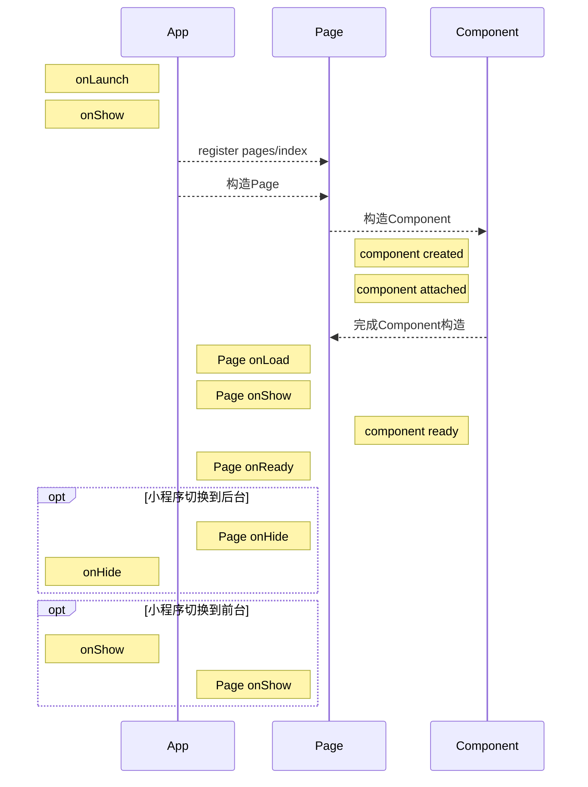
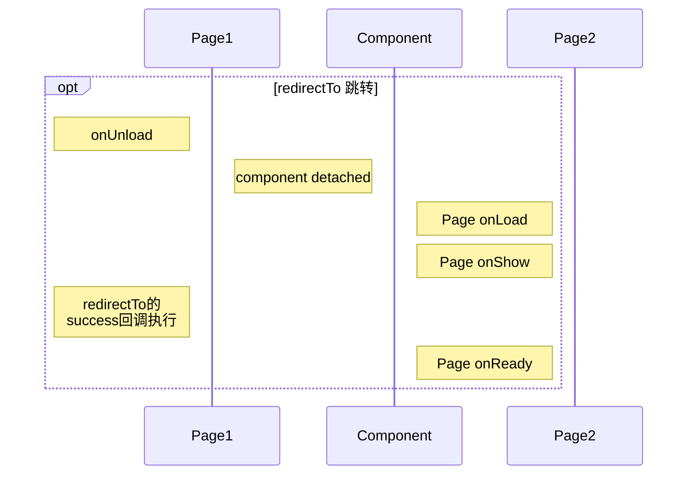

# 小程序声明周期

小程序有4个概念涉及到生命周期，**App**, **Page**, **Component**, **behaviors**

## App
App用来注册小程序，当打开小程序时，这个App就代表了小程序本身。

生命周期如下：
onLaunch  监听小程序初始化
onShow    监听小程序启动或切前台
onHide    监听小程序切后台
onError   错误监听函数
onPageNotFound   页面不存在监听函数
onUnhandledRejection   未处理的 Promise 拒绝事件监听函数
onThemeChange   监听系统主题变化

## Page
Page用来注册小程序中的一个页面

生命周期如下：
onLoad   监听页面加载
onShow   监听页面显示
onReady   监听页面初次渲染完成
onHide   监听页面隐藏
onUnload   监听页面卸载
onPullDownRefresh   监听用户下拉动作
onReachBottom   页面上拉触底事件的处理函数
onShareAppMessage   用户点击右上角转发
onShareTimeline   用户点击右上角转发到朋友圈
onAddToFavorites   用户点击右上角收藏
onPageScroll   页面滚动触发事件的处理函数
onResize   页面尺寸改变时触发
onTabItemTap   当前是 tab 页时，点击 tab 时触发

## Component
Component用来注册自定义组件

created   在组件实例刚刚**被创建**时执行
attached   在组件实例**进入页面节点树**时执行
ready   在组件在视图层布局完成后执行
moved   在组件实例被移动到节点树另一个位置时执行
detached   在组件实例被从页面节点树移除时执行
error   每当组件方法抛出错误时执行

## 两个问题

在我开发小程序时，遇到两个问题：
1. 在整个运行期，所有App、页面、组件的生命周期调用顺序是什么样子呢？
2. 在开发小程序时需要关注这个顺序问题吗？

App或者单个页面在运行时的生命周期调用顺序都很明确。

## 整个运行期生命周期调用顺序是什么样子

app初始化流程

页面redirect流程

## 开发小程序时是否要关注这个调用顺序
先说结论：需要关注，但是没有这么重要

为什么需要关注，举个例子，小程序官方文档上说**不要在 App.onLaunch 的时候调用 getCurrentPages()，此时 page 还没有生成**。如果不关注app和页面生命周期，就可能在App.onLaunch中尝试获取页面栈，导致运行错误。

没这么重要的原因解释起来就抽象。当我要关注页面和页面，页面和组件之间的生命周期函数调用顺序的时候，其实是我需要确保数据能正常在两者或更多组件中传递。数据的传递方法一般有下面几种：

1. 页面和组件，使用properties和triggerEvent
2. 页面之间，使用EventChannel
3. 使用setStorageSync将数据保存在全局

上面3种方法，都和生命周期函数无关。

## App和Page中onShow，onHide的区别
App.onShow首次调用是在App启动后，页面路由注册前，App.onShow会先于Page.onShow执行。而App.onHide是在Page.onHide之后执行。

## Page的onHide，onUnload的区别
Page.onUnload是在页面弹出页面栈，页面销毁时执行。Page.onHide是小程序切到后台时执行。页面被销毁时，不会执行Page.onHide。

## 生命周期函数参数的用法
### App.onLaunch(object)
- path 启动小程序的路径 (代码包路径)
  - "pages/index/index"
- scene 启动小程序的场景值
  - 1011
- query 启动小程序时的 query 参数
  - {brandid: "123"}
- shareTicket 转发信息
- referrerInfo 来源信息。从另一个小程序、公众号或 App 进入小程序时返回。否则返回 {}
- forwardMaterials 打开的文件信息数组，只有从聊天素材场景打开（scene为1173）才会携带该参数

### App.onShow
参数同Page.onLaunch

### Page.onLoad(Object query)
- 页面path后使用？拼接的参数

### Page.onPageScroll(object)
- scrollTop 页面在垂直方向已滚动的距离, 单位px

### Page.onAddToFavorites(object)
- webViewUrl 页面中包含web-view组件时，返回当前web-view的url

### Page.onShareAppMessage(object)
- from 转发事件来源。button：页面内转发按钮, menu：右上角转发菜单
- target  如果 from 值是 button，则 target 是触发这次转发事件的 button，否则为 undefined
- webViewUrl 页面中包含web-view组件时，返回当前web-view的url

### Page.onResize(object)
小程序屏幕旋转时触发

