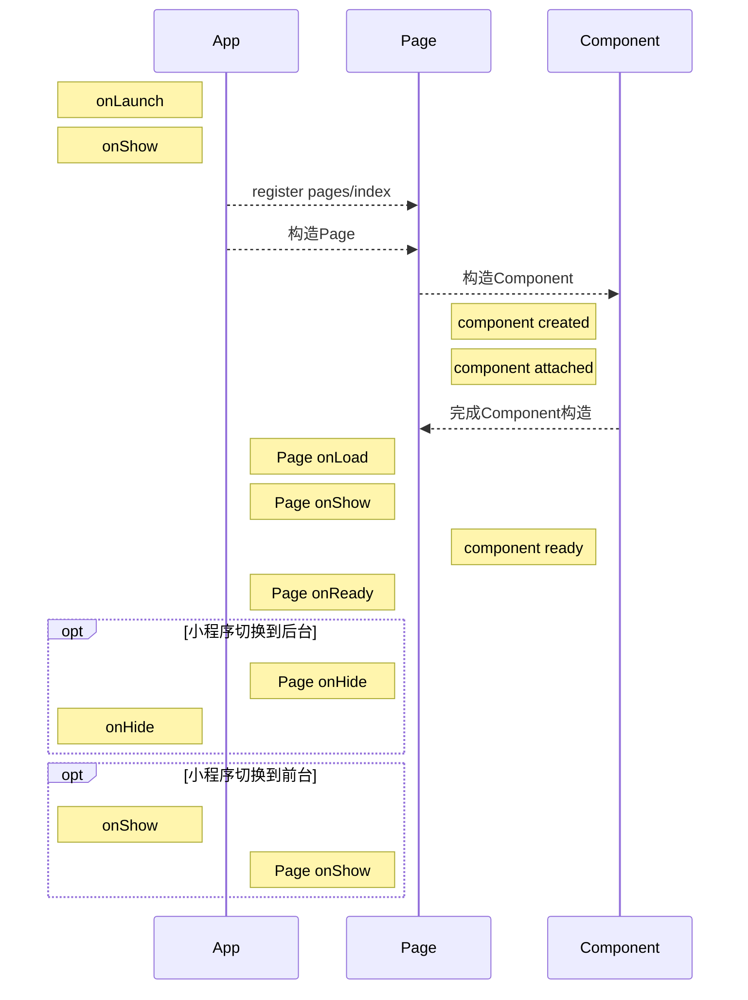
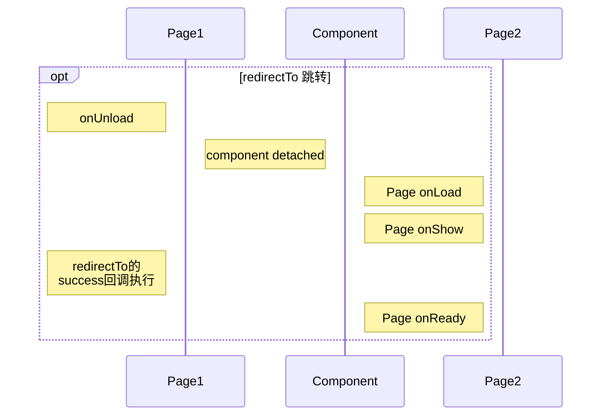

# 小程序声明周期

小程序有4个概念涉及到生命周期，**App**, **Page**, **Component**, **behaviors**

## App
App用来注册小程序，当打开小程序时，这个App就代表了小程序本身。

生命周期如下：
onLaunch  监听小程序初始化
onShow    监听小程序启动或切前台
onHide    监听小程序切后台
onError   错误监听函数
onPageNotFound   页面不存在监听函数
onUnhandledRejection   未处理的 Promise 拒绝事件监听函数
onThemeChange   监听系统主题变化

## Page
Page用来注册小程序中的一个页面

生命周期如下：
onLoad   监听页面加载
onShow   监听页面显示
onReady   监听页面初次渲染完成
onHide   监听页面隐藏
onUnload   监听页面卸载
onPullDownRefresh   监听用户下拉动作
onReachBottom   页面上拉触底事件的处理函数
onShareAppMessage   用户点击右上角转发
onShareTimeline   用户点击右上角转发到朋友圈
onAddToFavorites   用户点击右上角收藏
onPageScroll   页面滚动触发事件的处理函数
onResize   页面尺寸改变时触发
onTabItemTap   当前是 tab 页时，点击 tab 时触发

## Component
Component用来注册自定义组件

created   在组件实例刚刚**被创建**时执行
attached   在组件实例**进入页面节点树**时执行
ready   在组件在视图层布局完成后执行
moved   在组件实例被移动到节点树另一个位置时执行
detached   在组件实例被从页面节点树移除时执行
error   每当组件方法抛出错误时执行

## 两个问题

在我开发小程序时，遇到两个问题：
1. 在整个运行期，所有App、页面、组件的生命周期调用顺序是什么样子呢？
2. 在开发小程序时需要关注这个顺序问题吗？

App或者单个页面在运行时的生命周期调用顺序都很明确。

## 整个运行期生命周期调用顺序是什么样子

app初始化流程

页面redirect流程

## 开发小程序时是否要关注这个调用顺序

## App和Page中onShow，onHide的区别

## Page的onHide，onUnload的区别

